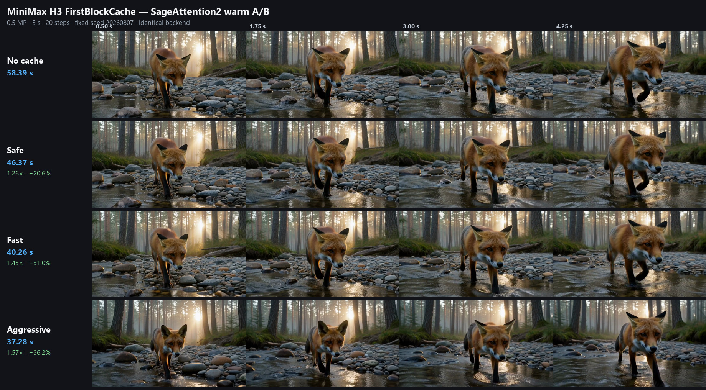

# ComfyUI MiniMax H3 FirstBlockCache

A lightweight, dependency-free model patch node for native ComfyUI MiniMax H3. It executes the first transformer block on every denoising step and reuses the cached residual of the remaining block stack when the current residual change is small enough.



## Measured result

RTX 5090, MiniMax H3 INT8 ConvRot, 0.5 MP, 5 seconds, 20 steps, fixed prompt and seed:

| Backend | No cache, warm | Fast, warm | Cache-only gain |
|---|---:|---:|---:|
| Native attention | 90.64 s | 60.82 s | **1.49× / 32.9% less time** |
| SageAttention2 | 57.96 s | 40.26 s | **1.44× / 30.5% less time** |

The cache-only gain is calculated against the no-cache run on the same attention backend. SageAttention acceleration is not included in that number. Full methodology and raw timings are in [benchmark/BENCHMARK.md](benchmark/BENCHMARK.md).

## Compatibility

Tested on an NVIDIA RTX 5090 using ComfyUI portable on Windows. The cache node contains no custom CUDA or Triton kernels and is not tied to Blackwell, so it is expected to work on RTX 30-, 40-, and 50-series GPUs whenever the installed ComfyUI build can already run native MiniMax H3. Performance and memory behavior on those GPUs have not yet been benchmarked.

## Modes

- `H3 Safe`: threshold `0.08`, protected 10–95% denoising window, at most two consecutive cache hits.
- `H3 Fast`: threshold `0.10`, the same protected window and hit limit. Recommended default.
- `H3 Aggressive`: threshold `0.12`, the same protected window and hit limit. Faster, with greater trajectory drift.
- `Custom`: manual threshold, start/end percentages, consecutive-hit limit, and optional temporal guard.

Manual controls are disabled in the UI unless `Custom` is selected. The named presets always keep their calibrated values. The optional temporal guard checks the most changed target-video latent frame in addition to the global mean, helping catch local motion that a global average can hide.

## Installation

Clone the repository into `ComfyUI/custom_nodes`, then restart ComfyUI:

```bash
git clone https://github.com/duckyshell/ComfyUI-MiniMaxH3-FirstBlockCache.git
```

No Python packages or model downloads are added.

## Connection

```text
Load Diffusion Model
        │
        ▼
MiniMax H3 FirstBlockCache
        ├────────► Basic Scheduler
        └────────► Basic Guider
```

Connect the patched `MODEL` output everywhere the unpatched diffusion model was previously used. Do not combine this node with EasyCache, LazyCache, CacheDiT, T8 Block Cache, or another `double_block` replacement.

## Video comparison

https://github.com/user-attachments/assets/ad504313-6a94-44ab-b3c5-beca2511e4cd

## Research relationship

This is an independent ComfyUI implementation informed by the cross-step caching design space described by NVIDIA Research's [Sol Video Inference Engine](https://nvlabs.github.io/Sana/Sol-Engine/) and its [paper](https://arxiv.org/abs/2606.23743). It is **not** an NVIDIA release, an official Sol Engine port, or a reproduction of NVIDIA code.

Sol Engine studies cache as one part of a broader full-stack acceleration system. The results reported here measure this node's cache effect alone and should not be compared directly with Sol Engine's full-stack figures.

## Limitations

FirstBlockCache is an approximation, not a lossless optimization. Fixed-seed output remains deterministic for a selected mode, but cached and uncached generations follow different numerical trajectories. Review important outputs visually. `Fast` is the practical default; use `Safe` when fidelity to the uncached trajectory matters more than speed.

## License

[MIT](LICENSE)
