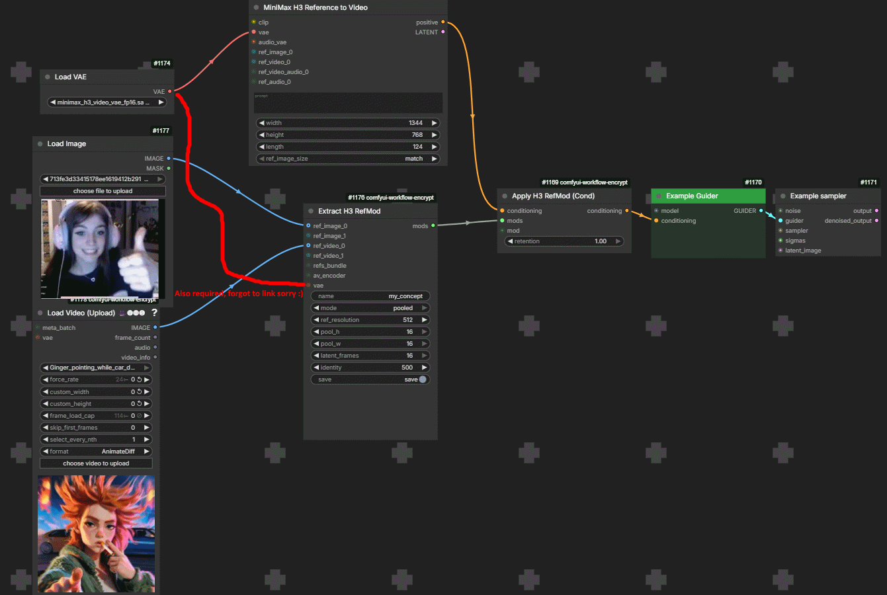
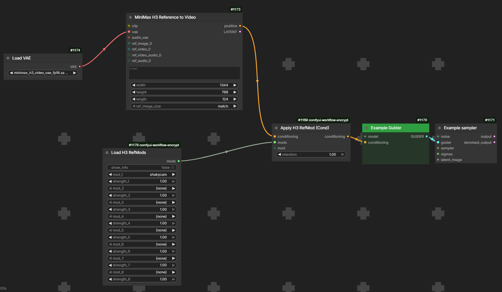

# ComfyUI-MiniMaxH3Mod - Changing the F#cking world with cigarretes and coffe.

> 🚧 **Under construction** — API and node schemas are still evolving. Mods
> stay compatible, but expect node names/inputs to shift between versions.

[](https://ko-fi.com/C0C2EV9GW)

## What's new — v0.2.6

- **Compact additive loaders** — Loader and Axis start with one visible slot.
  Use **+ Add RefMod** to reveal more, up to the existing eight slots. Each
  reference's controls stay together; connected slots are protected from removal.
- **Single-file visual + audio bundles** — Master can save both modalities in
  one `.safetensors` with `save_layout=bundle`. **Save H3 RefMod Bundle** also
  packs existing references without running extraction again.
- **Independent loader controls** — each Loader/Axis slot offers **All / Visual /
  Audio**, plus visual and audio strengths. Excluded modalities and modalities
  with strength zero are not loaded. Existing standalone files remain supported.
- **Bundle-aware library and Config** — find combined files in the library and
  edit selected components without dropping the other contents.

This is a storage and selection update. It does not fix voice identity or enforce
audiovisual synchronization. See [single-file bundles](#single-file-bundles).

### v0.2.5 and subsequent fixes

On `main` after v0.2.5: **Refresh RefMods** updates the current Loader/Axis
dropdowns from the RefMod folders without refreshing all ComfyUI models.
Selections and connected inputs are preserved. The library's Refresh also
updates that loader's dropdowns.

- **Clearer creation controls** — Create node titles, Full/Compressed Reference modes and Refinement Steps; old workflows remain accepted.
- **Explicit visual budget policy** — choose truncate or error before saving, including Master.
- **Compatibility fixes** — projected ClipProj encoders and batched H3 VAE decoding in Text Encode.
- **Full visual inspection** — optional full-video preview, with a lightweight first-frame default.

Since v0.2.0: extraction widgets accept token budgets above
65,536 and frame limits above 16, including Master. The `motion_sequence`
preset now respects the requested frame limit. Counts remain integers;
defaults are unchanged.

**Experimental: H3 RefMod Text Encode** presents saved references to the native
H3 text/vision encoder and reports their `<Picture n>`, `<Video n>` and
`<Audio n>` labels. Character binding and voice quality still require generation
tests; this is not a validated voice-cloning fix.

- **RefMod Master** — extract image/video and audio references in one node,
  with separate VAE inputs, one output bundle and a combined token budget.
- **Integrated audio** — create and load audio RefMods directly in this pack;
  no H3AudioMod installation required. Mix visual and audio refs in Apply.
- **Known failure: voice transfer** — audio support includes an observed music
  reference result, but speaker-identity transfer failed in current tests.
  This update does not provide working voice cloning. See
  [voice-transfer limitations](#voice-transfer-limitations).
- **Library and inspector** — search/filter your collection, select loader
  slots, inspect token costs and optionally preview stored visuals or audio.
- **Save H3 RefMods** — a dedicated output node saves bundles without needing
  a Preview, sampler or another downstream consumer.
- **Linked loaders fixed** — unresolved names from upstream nodes no longer
  fail queue validation, including both sides of the Axis loader.
- **Subfolders and external drives** — recursive discovery and saving to the
  registered RefMod root respect `extra_model_paths.yaml`.
- **Stale references and cache fixes** — Step Curve no longer retains refs
  from previous calls; loaders detect overwritten files. Bridge injection is
  scoped to the MODEL branch, with cleanup after sampling errors.
- **Extraction fixes** — masks follow image crops, video sampling stays
  bounded when frame counts are unknown, and runtime token/copy limits are
  enforced. Saves use atomic file replacement.
- **Fewer dependencies and repeated operations** — removed sibling-pack imports;
  shared extraction helpers and grouped multi-ref refinement reduce duplication.

Full history: [CHANGELOG.md](CHANGELOG.md). Validation and remaining limitations:
[REVIEW_FOLLOWUP.md](REVIEW_FOLLOWUP.md).

## RefMod in brief

RefMod saves MiniMax H3 image, video or audio references as reusable
`.safetensors` files. Load a saved reference, combine it with others, and pass
the bundle to **Apply H3 RefMod**. **Create H3 RefMod Master** brings visual
and audio extraction into one node.

Extraction uses the corresponding VAE. It does not train H3 weights or require
the diffusion model. The visual mode named `training` refines a compressed
latent; it is not LoRA training or supervised concept learning.

Saving avoids re-encoding the source on each run. Compression can reduce the
number of reference tokens processed during generation, at the cost of lost
information. Encode mode keeps more detail but does not remove the attention
cost of those tokens. Neither mode guarantees that only the desired attribute
will transfer: identity, clothing, background and composition can still mix.

## Try it

A ready-made example mod ships in the repo: **`mods/vanellope_example.safetensors`**.
It appears as `vanellope_example` in the `Load H3 RefMods` dropdown after
install — plug it into `Apply H3 RefMod` at strength 1.0 and prompt for
a candy racer in a karting scene.

## Install

1. Use a current ComfyUI with native MiniMax H3 support. RefMod does not
   import or require ComfyUI-MiniMaxH3. Connect a standard H3 video VAE to
   `vae`, the audio VAE to `audio_vae`, and native CONDITIONING to Apply.
   Old `av_encoder` connections are supported by reading the VAERef video
   checkpoint through ComfyUI's native VAE loader; they no longer load the
   sibling pack's VAE implementation or its audio checkpoint. Prefer `vae`
   to share an already loaded instance. Existing pack-conditioning objects
   remain accepted by Apply without importing their package.

2. **This pack**: clone into `custom_nodes/` and restart ComfyUI. Python
   deps (`safetensors`, `numpy`, `Pillow`) are in `requirements.txt` and are
   installed automatically by ComfyUI Manager (or `pip install -r
   requirements.txt` manually). `opencv-python`/`imageio` are optional video
   backends for the folder loader.
   
   ```bash
   git clone https://github.com/Luisacaotica/ComfyUI-MiniMaxH3Mod custom_nodes/ComfyUI-MiniMaxH3Mod
   ```

Tested on Windows; `os.path`-based paths so it should work on Linux/Mac, but
only Windows has been exercised so far.

Visual creation also offers `budget_policy`: `truncate` (the default) uses
existing frame reduction to fit `max_tokens`; `error` stops before saving if
the combined visual latent exceeds the budget after the multiplier. This applies
to both Create and Master. `max_tokens=0` disables the cap. Master's audio policy
and combined budget remain separate.

## What extraction actually optimizes

Create/Master now print which visual controls the effective configuration ignores
and which values a preset replaces. Apply reports actual curve/retention overrides
and inactive scrambling controls. These are execution-time notices; widgets remain
visible and editable, and cached nodes do not rerun just to print a notice.
The preset tooltip lists exact assignments. `motion_sequence` preserves the frame
limit and Refinement Steps and disables frame-difference extraction (`motion_only`)
to retain the visual sequence. `concept_type` is metadata, not an algorithm selector.
On Apply, `curve_shape` still matters with `constant` for non-linear shapes; a missing
saved override does not disable manual controls or discard a valid graph preset.

The UI calls the modes **Full Reference** (`encode` internally) and
**Compressed Reference** (`training` internally). **Refinement Steps** retains
its historical input ID `identity`. Saved files and API workflows keep these
internal identifiers; the descriptions below use them when discussing code.
Node titles now use **Create** instead of **Extract**, with unchanged node IDs.

A saved visual latent enters H3 through the native reference-token path.
That shares the model's reference mechanism, but does **not** establish parity
with a complete native reference workflow: resizing, conditioning, prompt
processing, sampling and other references can differ.

| Visual mode | Operation | Tradeoff |
| --- | --- | --- |
| `encode` | Resize/preprocess and store the VAE encode | Keeps more reference detail; larger token cost. Useful as the baseline for identity comparisons. |
| `training` | Pool the latent, then optionally refine it against the original VAE latent | Fewer tokens; detail and motion may be lost. |

The `training` loss is MSE between the full latent and a trilinearly enlarged
small latent. Only the small latent is optimized. No DiT, text instruction,
identity recognizer or motion objective participates. `identity` is the number
of refinement steps, despite its historical name; 0 means pooling only.
Increasing it does not teach the model which attribute to preserve or discard.

`concept_type` is descriptive metadata, not a separate learning algorithm.
The aliases `full` → `encode` and `pooled` → `training` remain supported.

## Storage

Mods are saved in the **first registered `refmods` folder**, including mappings
from `extra_model_paths.yaml`. The fallback is `ComfyUI/models/refmods/`, created
when saving. Set `is_default: true` in the YAML mapping to prioritize that root.
A write failure is reported rather than silently switching drives. Config updates
keep the original path of a loaded file. Loaders search all registered roots and legacy locations, including
the pack's own `mods/` folder, so existing files keep working. The standalone CLI
uses the folder registry available in its process; it does not load YAML mappings
on its own.

Both **Load H3 RefMods** and **Load H3 RefMod Axis** scan subfolders too:
`models/refmods/celebs/person.safetensors` appears as `celebs/person`.
Names use `/` without the `.safetensors` extension; linked Windows names
using `\` work too. Only files with RefMod metadata (`kind: image`, `video` or `audio`) are listed. `graph_presets/`, `.git/`, and `__pycache__/` trees
are skipped. Extract saves to the selected root by default; `subfolder` is optional.

You can convert `mod_#`, `mod_a_#`, or `mod_b_#` to inputs and connect a
STRING/combo output. Unresolved linked values are checked when the loader
runs. `None`, an empty string, `"None"`, and `"(none)"` skip the slot;
a resolved missing filename raises a missing-file error. Fixed dropdown
values are still checked when queuing. After adding or moving files,
refresh ComfyUI's node definitions to update the visible dropdowns.

Loader regression checks (run with ComfyUI's Python from this pack):
`python tests/test_loaders.py`. They use temporary safetensors files and
ComfyUI's queue validator; no generation models are needed.

## Integrated audio, library and inspection

### One character extractor

**Create H3 RefMod Master** combines the visual extractor's inputs and controls
with optional `audio` and `audio_vae` inputs. Connect the visual H3 VAE to `vae`
(or the existing `av_encoder`) and the H3 audio VAE to `audio_vae`. Either modality
can be omitted. Video-frame inputs do not implicitly include an audio track;
connect the source loader's AUDIO output separately when needed.

The master extracts visual references first, then audio, returning one `mods`
bundle for Apply/Inspect and a `details` string with paths and token totals.
Visual `max_tokens` and `audio_max_tokens` are separate; `max_total_tokens` limits
their combined cost (0 disables that extra limit). A failed extraction or budget
check does not save either result. Each final file is saved atomically, but saving
the pair is not a filesystem transaction.

With the default `save_layout=separate_files`, `name=hero` and
`subfolder=characters`, saving creates
`characters/hero_visual.safetensors` and `characters/hero_audio.safetensors`.
Select both in Load H3 RefMods to reconstruct the bundle after restarting.
Choose `save_layout=bundle` to save `characters/hero.safetensors` instead;
load that one file and select its modalities in the loader.
The internal visual extractor reports `(not saved)` because Master postpones
saving until both extractions and the total-budget check succeed. Master's final
`Created` / `Replaced` messages show the actual paths. `encode` and `training`
both replace existing files at those paths; an older file without the modality
suffix is a different destination. With `save=False`, Master only returns the bundle.
These are appearance and voice references, not joint character training or a
guarantee of audiovisual synchronization. The individual extractors remain available.

**Create H3 Audio RefMod** accepts `AUDIO` and the H3 **audio** VAE (the
32 kHz codec, not the video VAE). The implementation follows the tested
ComfyUI-H3AudioMod encode path: stereo normalized `[1,32,2,T]` latents,
40 frames/second, 2 tokens/frame, bounded 10-second encode chunks.
`max_seconds` explicitly selects the initial duration of the clip. A token
budget overflow raises an error by default; optional `truncate` keeps a
contiguous prefix rather than resampling speech/music in latent time.
Chunk boundaries may affect codec continuity; this is reference conditioning,
not a promise of lossless audio reconstruction.

Save audio to the selected RefMod storage root with an optional `subfolder`. Existing files
from `models/audio_refmods/` using `audio_refmod_meta` load directly. Both
common loaders, Apply, Step Curve, Config and the model-scoped bridge accept
mixed visual/audio bundles. Single-file bundles have per-slot visual/audio
strengths; multiple audio references inside one file share its audio strength.
Keep different voices in separate files if they need individual controls.
Standalone saves use format version 4; combined files use version 5. Older visual
mods remain readable. No `<Name>` prompt triggers are implemented.

Both loaders now have a **RefMod library** button: search names, subfolders,
concepts and descriptions, filter image/video/audio/bundle, choose a slot and Use.
Refresh rescans the disk. Connected slots are protected from widget replacement.
Close and Escape dismiss the library. Registered extra model roots are honored.

**Inspect H3 RefMod** reports paths, shapes, metadata, saved config and total
cost after copies. Optional matching `vae` enables `stored` or
`compare_strength` previews: `visual_preview=first_frame` decodes the first
latent frame by default; `full_video` decodes the complete stored visual latent
as an IMAGE batch for a video-combine/save node. Full previews use more memory.
In comparison mode, the stored sequence is followed by the weakened sequence;
audio outputs preview up to two seconds. Comparison appends the weakened
preview after the stored preview. This shows stored information, not a
prediction of generated identity/style quality.

`max_total_tokens` on loaders/Apply/bridge limits the sum after copies
(0 disables it). Oversized bundles fail explicitly. Extraction also fails
when one frame alone exceeds its cap. Loaded-file cache checks file and
sidecar changes, and is bounded to 256 MiB and 24 entries.

Visual Extract offers opt-in presets: `manual` preserves current widgets;
`identity_encode` selects encode/1024px; `style_experimental` selects an
8×8 training grid; `motion_sequence` keeps an ordered temporal sequence.
These are starting settings, not quality guarantees or semantic disentanglement.
Both visual and audio Extract support an optional save subfolder.

Validation: `python -m unittest discover -s tests -v` runs production-code
regressions. `python gauntlet_harness.py --device cuda` compares resident,
streaming and grouped multi-ref refinement with numerical parity checks.
`python tests/audio_smoke.py PATH_TO_H3_AUDIO_VAE` exercises the real codec,
safetensors roundtrip and native H3 reference layout without loading the DiT.

## File format, resolution and token budget

Standalone files contain a latent and JSON metadata in the safetensors header.
Visual latents have shape `[1,24,T,H,W]`; audio latents use `[1,32,2,T]`.
Version-5 bundles contain an ordered list of these references in one file;
they keep separate tensors, shapes and metadata. See [BUNDLE_FORMAT.md](BUNDLE_FORMAT.md)
for the schema used by loaders and third-party pickers.

Visual token count is **T × (H/2) × (W/2)**. H and W are even latent-grid
dimensions, not image pixels. Audio uses **2 × T** tokens.

| Visual latent grid | Tokens per latent frame |
| --- | --- |
| 8×8 | 16 |
| 16×16 | 64 |
| 32×32 | 256 |
| 64×64 | 1024 |

For example, a square 1024×1024 image encoded to a 64×64 latent costs 1024
tokens and about 192 KiB of fp16 tensor data, plus metadata. A rectangular
image with a 1024-pixel short edge can cost more. Four 16×16 latent frames
cost 256 tokens; sixteen 64×64 frames cost 16,384 tokens before budget fitting.

A small grid is spatial compression, **not a concept extractor**. It may retain
colors and large structures while losing face detail, texture or useful motion.
A larger grid preserves more information, including unwanted content. There
is no validated universal 8×8 concept / 16×16 identity sweet spot.

`multiplier` repeats the extracted visual latent along its time axis; loader
`copies` repeats a reference block. Both increase token cost. Neither adds new
information, and neither promises a proportional increase in influence.

Visual `max_tokens` defaults to 5120 (0 disables it). Budget fitting drops
near-duplicate latent frames, then resamples time if needed, after repetition.
This can damage motion timing; inspect the resulting frame/token count. If a
single spatial frame exceeds the cap, extraction raises an error. Audio instead
uses the explicit error/prefix-truncation policy described above.

## Nodes (`MiniMax-H3/mod`)

| Node | Purpose |
| --- | --- |
| H3 RefMod Text Encode | Encode a prompt with numbered saved references; outputs conditioning and the reference map. |
| Create H3 RefMod Master | Visual and/or audio extraction into one bundle, with separate VAE inputs. |
| Create H3 RefMod | Visual extraction, masks, compression and optional refinement. |
| Create H3 Audio RefMod | Audio extraction with duration and token limits. |
| Save H3 RefMods | Save a bundle as an output node; no downstream connection required. |
| Save H3 RefMod Bundle | Pack selected references into one `.safetensors`; no downstream connection required. |
| Load H3 RefMod Folder | Ordered image/video references from a folder. |
| Load H3 RefMods | Up to 8 slots with strength, copies and optional total budget. |
| Load H3 RefMod Axis | Select A or B with a signed strength; 0 skips the slot. |
| Apply H3 RefMod | Append refs to native CONDITIONING or an existing pack-conditioning object. |
| H3 RefMod Step Curve | Change marked RefMod latents during denoising via the MODEL connection. |
| Fix H3 RefMod Config | Persist Apply/Step Curve settings in mod metadata. |
| Inspect H3 RefMod | Metadata, token totals and optional VAE previews. |
| Continuum RefMod Bridge | Inject refs through the MODEL sampling hook. |

Older `Apply H3 RefMod (Cond)` workflows migrate to the unified Apply node.
The legacy Bridge Disarm node remains for compatibility; bridge state now
belongs to the MODEL branch.

### Prompting with numbered RefMods (experimental)

Connect `Load H3 RefMods → H3 RefMod Text Encode.mods`, the native H3 CLIP
or an H3-compatible projected CLIP (current ClipProj Loader all-in-one),
and the H3 video VAE for visual references. Enter your prompt and connect the
CONDITIONING output to the sampler's positive input. Keep the workflow's normal
negative conditioning and generation latent. This node already attaches the
references: do not Apply or Bridge the same bundle again.

Connect `reference_map` to a text display to see the actual mapping. For example,
if it reports `<Picture 1> = alice` and `<Picture 2> = beth`, try:

```text
[Shot1]
The woman in <Picture 1> stands on the left.
The woman in <Picture 2> stands on the right.
They turn toward each other and smile.
```

The map counts each modality separately, in bundle order, excluding zero-strength
entries. Copies receive additional labels. Stacked photos saved as one video-kind
RefMod receive one `<Video n>` label, not one Picture label per original photo.
Keep different characters in separate files. Neither the filename nor description
is a trigger, and `<Subject n>` is not automatically bound to a loader slot.

Visual presentation requires decoding the stored latent for Qwen; it adds VAE and
vision-encoder work. Compressed latents reconstruct less detail than the original
photos. Videos are decoded and then sampled for Qwen at 2 fps; `reference_fps`
sets reconstructed playback timing (default 24). Original timing is not recovered
from pooled or stacked refs. Audio presentation uses the native numbered label
without decoding audio. Loader strengths affect the latents; saved Apply curves
and overrides are not applied by this node. `max_total_tokens` limits DiT reference
tokens, not Qwen tokens or VAE decode memory.

Presentation/payload tests pass, but full GPU generation and identity/voice
quality remain unverified. Compare against the old Apply workflow with the same
references, prompt and seed.

### Saving without a Preview or sampler

Connect `Extract / Master / Loader → Save H3 RefMods` and queue the workflow.
The Save node is an execution output, so its own output sockets may stay
unconnected. Set the extractor's `save=False` to avoid saving twice; the Save
node handles persistence. It also provides `mods` and `saved_paths` outputs.

`filename_prefix` is prepended to each mod name, and `subfolder` is relative to
the configured RefMod storage root. Existing destination files are replaced.
Repeated copies of the same mod are written once; distinct mods with the same
name receive numbered suffixes within the bundle. Files keep their stored
latents/config; loader strengths remain in the output bundle and are not baked
into the saved latents. As with other output nodes, ComfyUI may reuse cached
results when inputs have not changed.

### Single-file bundles

For new references, set **Create H3 RefMod Master → save_layout = bundle**.
For existing files, connect **Load H3 RefMods → Save H3 RefMod Bundle**, choose
a name/subfolder, and queue. The output node writes one file; it does not require
a sampler or Preview. Existing destinations are replaced atomically.

Both loaders expose these controls for each slot:

Only added slots are shown. **Remove RefMod N** clears that slot and restores its
defaults; slots with connected inputs cannot be removed. Old workflows reveal
their configured/connected slots automatically, and the library can reveal a
hidden slot when selecting a file. Slot numbers stay stable when another slot
is removed. Refresh the browser after updating to load the new interface.

| Control | Effect |
| --- | --- |
| `components_N = All` | Load every visual and audio member in that file. |
| `components_N = Visual` | Load images/videos only. |
| `components_N = Audio` | Load audio only. |
| `visual_strength_N`, `audio_strength_N` | Multiply the slot strength for the chosen modality; zero skips it. |

For example, load character A with **All**, and character B with **Visual** to
use both appearances and only A's audio reference. With slot strength `0.8`
and audio strength `0.5`, the resulting audio reference strength is `0.4`.
The total-token budget counts only loaded components, including copies.

The file stores each distinct reference object once, preserving member order.
Runtime copies and strengths are retained on the Save node's output but are not
baked into the file. Loading the file later uses the loader's current controls.
Config preserves unselected members when updating a combined file. To export
members back into standalone files, use **Save H3 RefMods** with a different
prefix or subfolder.

Existing standalone RefMods and workflows keep working. Version-5 files require
a bundle-aware reader; v0.2.5 and older third-party readers are not guaranteed
to load them. The default Master save layout remains `separate_files`.

Packaging visual and audio references together does **not** bind a voice to a
character, fix reference mixing, or add synchronization timestamps. Original
audio passthrough is also separate: this format stores encoded audio latents,
not the original waveform. To preserve the original soundtrack, connect the
source loader's AUDIO output to your video-saving workflow.

### Strength and reference-frame curves

Loader strength and Apply retention are multiplied. For a positive resulting
weight `w`, the stored latent is transformed as:

```text
w * latent + (1 - w) * blur(latent)
```

A zero row/master strength drops the reference block. A zero **frame-curve**
weight instead leaves a blurred frame in the block; it does not remove tokens.
At 1, the stored latent is unchanged. At 0.4, the mixture is 40% original and
60% blurred. This is not an attention weight or a percentage of identity.
Blur can leave palette, framing and broad structure while discarding desired
texture. Smooth identity fading and an in-distribution result are not guaranteed.

The curve on Apply runs across **the reference's latent frames**, including
stacked images. `concept_at_start`, `concept_at_middle`, `concept_at_end` and
`concept_at_ends` are historical labels for where the envelope is strongest
in that reference sequence. **They do not schedule an event in the output video.**

`constant` is the default. `curve_shape` selects the envelope shape and
`curve_value` its value; for one latent frame, value acts as a scalar cap.
Printed effective strength is a summary of the configured weights, not a
measurement of the model's actual attention or the resulting concept transfer.

### Using RefMods with ComfyUI-H3-Continuum

Connect `Load Model → Continuum RefMod Bridge → sampler.model`, and connect
`mods` to the bridge. The bridge clones the MODEL and appends refs through
ComfyUI's public outer-sampling hook before each chunk's conditioning is
prepared. It restores the previous conditioning on completion, error or
cancellation. There is no global bundle, TTL, or patch of Continuum code.
Different model branches can carry different bundles. `enable=False` removes
this bridge from its output clone. The old Disarm node is retained for saved
workflows; use the bridge toggle or bypass its MODEL output instead.


### Ref scrambling (seed)

`scramble_seed=-1` disables scrambling and keeps all bundle entries in order.
With a nonnegative seed, `scramble_mode=shuffle` changes only their order;
`subset` selects up to `scramble_keep` entries. The selection is deterministic
for the same seed and bundle. `legacy_subset` retains the old random-size subset
behavior for workflows missing the new option. These operations act on bundle
entries, not on frames inside one saved mod.

### Curve graph and presets

Apply's `debug` IMAGE output plots the configured envelope, not a prediction
of where a concept will appear. `save_preset_as` writes a PNG with embedded
curve metadata under the selected RefMod root's `graph_presets/` folder.
Choose it in `graph_preset` to override the manual curve widgets. Share that
PNG to share the settings. Older JSON presets remain readable.

### Ref strength over denoising steps

Connect **H3 RefMod Step Curve** between the model loader and sampler.
It applies an envelope over denoising progress, relative to the run's schedule
start. This is different from the reference-frame curve and from output time.
Early/late weighting can change the result, but there is no guarantee that it
isolates composition, identity, texture or any particular semantic attribute.

The wrapper processes the current payload without retaining reference tensors
between calls. It transforms only marked RefMod references; empty payloads pass
through. Other reference latents are not directly modified, although generated
content can still change through interactions among all conditioning inputs.
Chained Step Curve nodes compose their transformations.

### Fixing configs into a mod (`override`)

**Fix H3 RefMod Config** stores your chosen Apply and Step Curve settings
in the mod file. Recipients can reuse those settings, although results still
depend on their model, prompt, sampler and other references:

1. **Creator:** tune the Apply + Step Curve until the concept behaves,
   then set the same values on `Fix H3 RefMod Config` (wire `mods`
   through it — `Loader → Config → Apply`). Run once: the config
   (`retention` + `curve` + `step_curve`) is written into the mod's
   safetensors metadata and the file is re-saved in place. Share the
   `.safetensors` as usual.
2. **User:** load the mod, flip **`override`** on Apply H3 RefMod (and/or
   connect the bundle to H3 RefMod Step Curve's optional `mods` input and
   flip its `override`) — the node reads the first mod in the bundle that
   carries a config and uses *those* settings instead of the widgets.
   `override` off (default) = today's behavior, manual parameters.

If a bundle has no mod with a saved config, `override` falls back to the
manual widgets and prints a note to the console — it never silently does
nothing. The curve graph `debug` output shows the overridden curve, so it's
obvious which settings actually ran.

### Concept axes (signed A/B sliders)

`Load H3 RefMod Axis` pairs an A-side mod and a B-side mod on **one signed
`value` slider** per row ([-1, 1]): negative values use the A mod, positive
values use the B mod, and the magnitude is the reference strength (same 0-1
math as the loader). A value of 0 skips the row. This selects between two references; it does not learn a continuous semantic
age axis. For example:

1. Extract a mod from your **young** refs (baby photos) and another from your
   **old** refs (elder man).
2. `Load H3 RefMod Axis`: `mod_a` = young mod, `mod_b` = old mod,
   `value = -0.6` → young at 60% strength, `value = +0.8` → old at 80%,
   `value = 0` → no age reference at all.

Same for other contrasting references: clean ↔ weathered, modern ↔ vintage, calm ↔
energetic. Rows are independent, so several axes can live in one node (up to
8), and the output feeds the same `Apply H3 RefMod` nodes with the
same `retention` master control.

### Minimal workflow

1. Connect images/video frames to **Create H3 RefMod** or **Master**, with the
   standard H3 video VAE. On Master, connect AUDIO and the H3 audio VAE if wanted.
   Image slots use the first image of a batch; video slots preserve a sequence.
2. Choose a name and optional subfolder. For a visual baseline, compare `encode`
   against `training` using the same refs and generation settings. The visual
   node defaults are `training`, 16×16 grid, `latent_frames=16`, `identity=500`,
   `ref_resolution=1024`, and `max_tokens=5120`; presets can override some of them.
3. Connect the output bundle directly to **Apply H3 RefMod**, or load the saved
   file(s) with **Load H3 RefMods**. Connect your H3 conditioning to Apply and
   its result to the sampler's matching conditioning input.
4. Use **Inspect H3 RefMod** for stored information and token cost. Evaluate the
   generation against a no-RefMod baseline with the same prompt and seed.

Describe the desired subject/action in the prompt and what should remain from
other inputs. A prompt can clarify intent, but it does not guarantee selective
transfer, exact dance/camera reproduction, face replacement or silence between
spoken phrases. RefMod currently has no `<Name>` trigger parser.

## Examples

Development examples; screenshots may show older names/defaults. Individual
results are illustrations, not controlled benchmarks or quality guarantees.

### Voice-transfer limitations

Current voice tests did not reproduce the reference speaker's voice reliably.
In one test, a masculine voice reference was supplied for a female character,
but the output retained a feminine voice instead of matching the reference.
Treat speaker-identity transfer / voice cloning as not working in this update,
even though music-reference conditioning has produced a successful example.

H3's architecture or checkpoint behavior may contribute, but the cause has
not been isolated. There is also a known difference in the current RefMod
integration: Apply appends audio latents after text encoding, while the native
H3 reference node also presents numbered audio labels during tokenization.
The experimental H3 RefMod Text Encode node now uses that native presentation
path, but voice transfer has not been retested with it.
Until a matched native-versus-RefMod comparison rules out that difference,
we cannot attribute the failure exclusively to H3 or rule out RefMod integration.

### Music reference with RefMod

In this example, the author supplied a music clip to RefMod and reported that
the generated video included the reference music as background audio.

**Input music** — waveform preview with audio. Enable sound in the player.

https://github.com/user-attachments/assets/a3e1c07a-cc88-47e2-b754-2d8ca2bc3c19

[Original MP3](examples/audio_input.mp3) · [Waveform MP4](examples/audio_input_preview.mp4)

**Generated video** — the RefMod music-reference result.

https://github.com/user-attachments/assets/ef72642c-80c2-4152-82fe-915e6dd57824

[Original output MP4](examples/audio_refmod_example.mp4)

Prompt used, unchanged:

```text
[Shot1]
The ginger woman is walking on an office and dancing, the camera viewer is tracking in her head following every rotation and position.

music playing on background.
```

### Extracting

An image and a video ref being extracted and fed into a conditioning node:



### Loading mods

`Load H3 RefMods` with several mods stacked (LoRA-loader style, one
strength per row):



### Loading a ref folder

`Load H3 RefMod Folder` pointed at an absolute path (a whole movie
dataset) — images + videos loaded in one shot, with the count shown in
the preview text:


### Pool-size examples

Observed results with 8×8 and 16×16 pools. These examples do not establish
a universal concept/identity split:


An identity success from real use — the author's own face extracted as a
mod and prompted as **"ginger woman"**, and a third example pushed into
JoJo Bizarre-style rendering:


### Curve controls

The same mod run three ways — no curve, `concept_at_end`, and
`concept_at_end` with the loader's `copies` set to 3 (the same row injected
three times; this example showed a stronger effect):


### Known limitations

Fast, high-speed motion is the hard case. A quick sequence — Sasuke doing
hand signs, a fight flurry, a rapid dance step — gets smeared into
something slower and softer, because the reference is compressed into a
handful of latent frames and the model fills the gaps with its own idea of
how motion looks:


Things that help today: extract only the *moments* that matter (trim the
clip to the actual hand-sign burst instead of the whole scene), use more
`latent_frames` / a higher `ref_resolution`, and describe the motion in
the prompt so the model has an anchor for what it's seeing.

### Bulk folder loading

`Load H3 RefMod Folder` reads supported images (png/jpg/webp/bmp/gif) and video
(mp4/webm/mov/mkv/avi) in a folder — images first, then videos, by filename.
Type an absolute path, or a folder name inside ComfyUI's `input/` (empty =
`input/` itself). Feed its `refs_bundle` output into `Create H3 RefMod` to
bulk-extract a whole character shoot in one go:

```
Load H3 RefMod Folder (folder: E:/vanellope_refs) ──refs_bundle──┐
                                                                  ├─ Create H3 RefMod ─> vanellope.safetensors
ref_image_1 (hand-picked shots) ─────────────────────────────────┘
```

Bundle refs are appended after the autogrow refs, so `ref_image_1` still
anchors the canvas. Unreadable files are skipped with a note; `max_items`
caps the item count and `max_frames` caps the number of sampled video frames.

### Multiple references and merge

By default, visual refs are encoded separately and stacked along the latent
time axis. A video contributes a sequence, not just one frame. Spatial resizing,
temporal pooling/sampling and the token cap can still discard information.
In encode mode, multiple refs use a common canvas based on the first source;
other aspect ratios can be center-cropped to fit it.

With `merge=True` in training mode, one grid minimizes mean reconstruction
error across targets. For equal target shapes, this has the same gradient as
reconstructing their average. That is not semantic discovery of what the
examples share: misaligned faces, motion and backgrounds can average into blur.
Compare merge against stacking rather than assuming it removes unwanted content.

The current refinement groups same-shaped targets on CPU and processes gradient
contributions sequentially. This reduces repeated work; it does not change the
objective into DreamBooth, Textual Inversion or control/target edit training.

### Motion-only extraction (experimental)

For a motion-transfer comparison with native Ref2VA, start with one video,
Full Reference, `multiplier=1`, `max_tokens=0` (or an adequate budget with
`budget_policy=error`), and enough source frames. On Apply, use `retention=1`,
`curve_direction=constant`, `curve_shape=linear`, `curve_value=1`, no preset
override, and `scramble_seed=-1`. A constant linear curve at **0** replaces
every reference frame with its blurred version; it does not disable the curve.
Spatial pooling and Refinement Steps do not affect Full Reference mode.

Apply alone does not present the reference video to Qwen. Compare with H3
RefMod Text Encode when the workflow accepts external conditioning, using the
reported Video label and without applying the same refs twice. This reconstructs
visual presentation from saved latents, so it is still not an exact replay of
native Ref2VA preprocessing or source timing. Dense textual motion descriptions
are not a replacement for the reference's visual input. These are diagnostic
settings, not validated optimal settings or a guarantee of motion fidelity.

For longer video references, increase `latent_frames` and the token budget
together. In `encode`, `latent_frames` limits sampled **source frames** before
the VAE's causal 4k+1 trimming and temporal compression; set it at least to
the source frame count to avoid that sampling. In `training`, it limits the
**latent frames** retained after encoding. It is not a duration in seconds.
`max_tokens=0` disables the extraction token cap; loader/Apply/bridge budgets
are separate. Higher values increase memory and attention cost and do not
guarantee faithful motion transfer.

`motion_only` in training mode encodes normalized absolute frame differences,
`abs(frame[t+1] - frame[t])`. These highlight change, including camera motion,
lighting variation and compression artifacts. They can still reveal contours
and appearance, and absolute differences do not explicitly encode direction.

This is not optical flow, a pose trajectory or a trained motion-conditioning
channel. H3 may interpret the difference images as visual content. Still-image
refs retain their appearance with a warning. Treat this mode as an experiment,
not as guaranteed separation of motion from identity or background.

## Standalone extraction (visual only)

Use the Python environment that runs ComfyUI. Both commands set their mode
explicitly; the CLI default is `training`.

```bash
# Store the VAE encode as an identity comparison baseline
python custom_nodes/ComfyUI-MiniMaxH3Mod/extract_mod.py \
    --image char.png --vae path/to/h3_video_vae.safetensors \
    --name my_character --mode encode --resolution 1024

# Compressed video reference; evaluate motion loss against encode
python custom_nodes/ComfyUI-MiniMaxH3Mod/extract_mod.py \
    --video dance.mp4 --vae path/to/h3_video_vae.safetensors \
    --name dance --mode training --pool 16 --latent-frames 16 --identity 500
```

Other options include `--pool-w`, `--max-tokens`, `--multiplier`, `--subfolder`,
`--output`, `--max-edge`, `--max-frames`, `--description`, `--concept-type` and
`--device`. Run `--help` for defaults. Video decode uses OpenCV or imageio.
Files use embedded metadata; legacy JSON sidecars remain supported.

## Validation and experimental training status

Run production regressions with `python -m unittest discover -s tests -v`.
The suite covers loaders/queue validation, storage, caches, curves, bridge,
Master orchestration and audio storage. Codec checks used a real audio VAE;
these are not full H3 voice/visual quality evaluations.

`gauntlet_harness.py` compares three implementations of the existing model-free
MSE refinement. `tests/h3_gradient_probe.py` is a separate gradient-feasibility
experiment with a small randomly initialized H3 architecture. Its success does
not establish compatibility with a full INT8/ConvRot checkpoint, memory fit,
concept learning or edit quality. A train-through-H3 ComfyUI node is not yet
implemented. See [REVIEW_FOLLOWUP.md](REVIEW_FOLLOWUP.md) for recorded results.

## License

[MIT](LICENSE) — © 2026 Luisa (luisacaotica).
